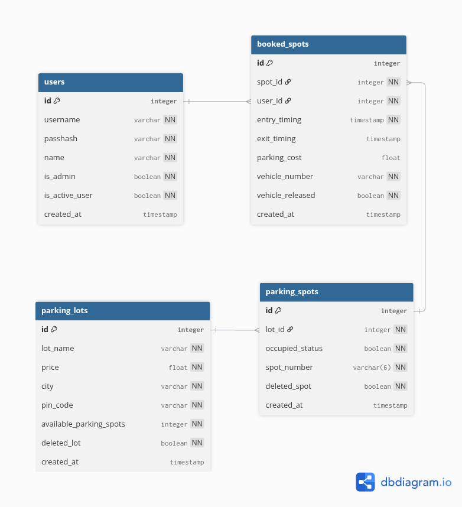
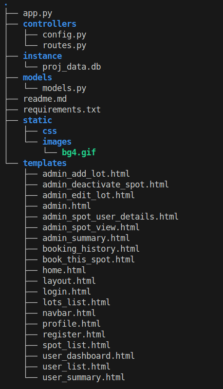

# ParkMatrix

The Vehicle Parking App is a role-based web application designed for real-time management of 4-wheeler parking spaces.
It supports:

Admin → Full control over lots, spots, and users

Users → Book, release parking spots & track parking history

The project follows the mandatory use of:

Flask (Backend)

Jinja2 + HTML + CSS + Bootstrap (Frontend)

SQLite (Database)
## 🧑‍💼 Roles
### 1. Admin

Superuser (created automatically when DB is created)

Can create / edit / delete parking lots

Spots auto-generated based on available_parking_spots

View all users

View parking status & dashboards

Delete lot only if all spots are empty

### 2. User

Register / Login

Select parking lot

Booking auto-allocates first available spot

Release spot

View their booking history & charts

## 🛠️ Tech Stack
Component	Technology
Backend	Flask
Frontend	Jinja2, HTML, CSS, Bootstrap
Database	SQLite
Charts	Chart.js (optional)
Security	Werkzeug Password Hash
## 🚦 Core Functionalities
### 🔐 Authentication

User Register / Login

Admin Login (default admin auto-created)

Session-based login

Role checking (auth_required / admin_required decorators)


## 🧱 ER Diagram (Description)


## Folder Structure



## Authors

- [@gooolu-git](https://github.com/gooolu-git)


## Installation

```bash
Clone the repository
git clone https://github.com/23f2003761/vehicle_parking_app_v1.git
cd vehicle_parking_app_v1

# Create and activate virtual environment
python3 -m venv venv
source venv/bin/activate      # Linux / macOS
venv\Scripts\activate         # Windows

# Install dependencies
pip install -r requirements.txt

# Run the application
flask run


